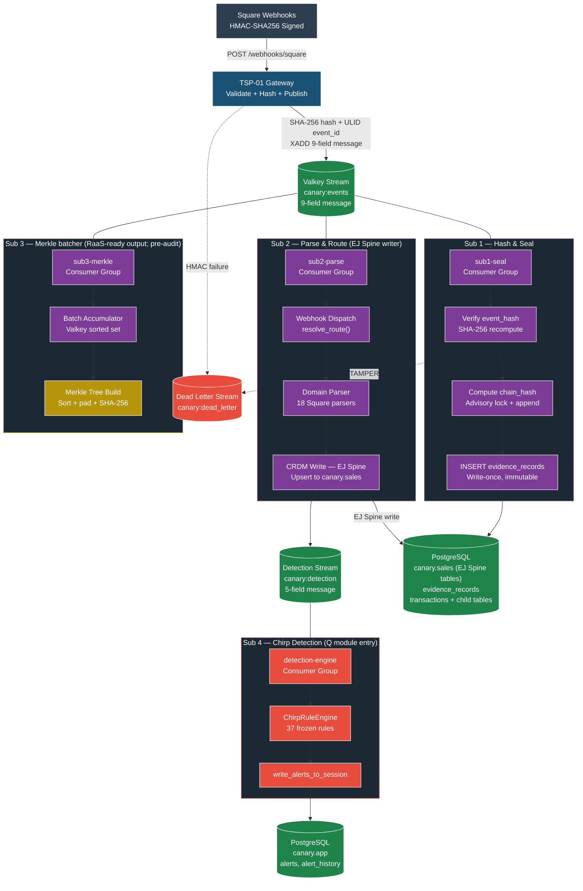

# Canary EJ Spine + Sales Audit — the Canary-Native Naming for the Perpetual Layer

> **Naming alignment.** The CATz substrate articles describe a generic
> "perpetual movement layer" pattern (derived from the Retek RMS
> stock-ledger framing). In Canary's actual code and Linear backlog,
> this layer is named the **EJ Spine** (Electronic Journal). The
> projection layer that scrubs and aggregates the EJ stream into
> period-summary outputs that downstream tools consume is named
> **Sales Audit** (the ReSA pattern from Retek). This article anchors
> the naming so the substrate primitives, the merchant tool integrations,
> and the agent surfaces use one vocabulary.

## The TSP orchestration that writes the EJ Spine

The Transaction Sealing Pipeline (TSP) is what produces the EJ Spine
in real time. Pre-authored figure from the Canary Atlas (`fig-p00`,
[full source](../../Canary/docs/atlas/pipeline/fig-p00-tsp-orchestration.md)):

**Read against the EJ Spine framing:**

- **Sub 2 ("Parse & Route") is the EJ Spine writer.** The "CRDM Write" node is where every parsed Square event becomes an EJ row in `canary.sales` (transactions + child tables: line items, tenders, discounts, modifiers, refund links, cash drawer events, gift card events, loyalty events, disputes, invoices). This is the moment EJ-has-everything is materialized.
- **Sub 1 is the chain-of-custody seal.** Independent of EJ writes. Provides forensic integrity to the raw bytes that Sub 2 then parses into EJ shape.
- **Sub 3 produces RaaS-ready output (Merkle batches).** Per [[canary-raas-positioning|RaaS positioning guardrail]], the downstream Bitcoin anchor is research/pre-audit and not part of the perpetual-vs-period substrate trust narrative. The Merkle batcher itself is operational; what it gates against is not.
- **Sub 4 is the Q (Loss Prevention) entry point.** Subscribes to the detection stream Sub 2 publishes; runs the 37-rule Chirp catalog against EJ-shaped events.

Sales Audit (the scrub-and-aggregate projection layer) sits *downstream of EJ writes* and is not pictured here — it reads from `canary.sales` (the EJ Spine tables) and produces clean projections for downstream consumers (merchant accounting tools, period reports, etc.). A separate figure for Sales Audit is queued.

**Per-transaction state machine.** The state-machine view of one transaction's journey through this pipeline is captured in atlas figure L-01 (Transaction Lifecycle) at `Canary/docs/atlas/lifecycle/fig-l01-transaction-lifecycle.md`.

## EJ Spine — what Canary actually has

The Electronic Journal is the transaction spine. It carries **everything**
that lands on Canary from a connected POS:

- Every payment, refund, void, no-sale, paid-in, paid-out, exchange
- Every transaction line item, modifier, discount, tax, service charge
- Every tender (cash, card, gift card, loyalty redemption)
- Every cash-drawer event (open, close, skim, deposit)
- Every loyalty event (point accrual, redemption, enrollment)
- Every gift card event (load, redemption, balance check)
- Every dispute and invoice event
- Every employee context (clock state, location, device)

The EJ is append-only at the per-event level, hash-chained per merchant,
and queryable across every child table. It is what the user means when
they say "it has everything" — there is no operational signal from the
POS that the EJ does not capture.

In code terms, the EJ Spine is the joined view across:
- `sales.transactions` (the root)
- `sales.transaction_line_items`
- `sales.transaction_tenders`
- `sales.refund_links`
- `sales.cash_drawer_*`
- `sales.gift_card_*`
- `sales.disputes`
- `sales.invoices`
- `app.evidence_records` (the per-event seal)
- `app.ej_links` (links source-system order ID to local transaction UUID)

Module T (Transaction Pipeline) is the **publisher of the EJ Spine** at
v1. As C/D/F/J/S/P/L/W ship, each one publishes additional movement
verbs into the same EJ — receipt + transfer + RTV + adjustment events
from D, cost-update events from C, markdown events from P, time-clock
events from L, etc. The EJ is the universal substrate every spine
module writes to.

## Sales Audit — the scrub-and-aggregate projection layer

Raw EJ output is too noisy for downstream consumers. It contains:

- Cancelled transactions that were rolled back mid-flight
- Duplicate webhook deliveries that the receipt path deduplicated
- Test transactions (training mode, demo mode)
- Voided line items that were re-rung
- Pending events that have not yet completed
- Edge-case transactions that need human adjudication (dispute-in-progress, etc.)

**Sales Audit** (named for and patterned on Retek's ReSA — the Sales
Audit module) is the projection layer that:

1. **Scrubs** — drops or flags non-authoritative events (cancelled,
   duplicate, test, pending, adjudication-needed) so downstream
   consumers see clean data
2. **Aggregates** — rolls up per-event detail into the granularity each
   downstream consumer needs (per-transaction summary, per-day
   department total, per-week store P&L line, per-month GL posting
   batch)
3. **Reconciles** — compares its own scrubbed-and-aggregated output
   against the merchant's existing tool's period summary (where the
   merchant has one) and surfaces variance

Sales Audit is what the merchant's QuickBooks / Xero / Gusto / loyalty-
platform / e-commerce-platform actually consumes when they integrate
with Canary. They never see raw EJ. They see Sales Audit-scrubbed
projections at the granularity their tool expects.

## Where this maps in the substrate articles

The CATz substrate articles describe the same pattern in generic terms:

| CATz substrate generic term | Canary-native name |
|---|---|
| Perpetual movement layer | **EJ Spine** |
| Movement publisher (per-module) | EJ Spine writer (T at v1; D/C/F/J/etc as they ship) |
| Period-summary projection | **Sales Audit** scrubbed-and-aggregated output |
| Merchant's existing tool subscribing to projection | Reads Sales Audit, not raw EJ |
| Reconciliation surface | Sales Audit's variance report against merchant tool's period summary |

The [[Canary-Retail-Brain/platform/perpetual-vs-period-boundary|perpetual-vs-period boundary]]
article describes the seam between perpetual movement and period summary.
In Canary, that seam is **between the EJ Spine and Sales Audit**:
everything EJ-side is Canary's perpetual; everything that flows out of
Sales Audit to a merchant tool (or to Canary's own period reports) is
projection.

The staged migration phases re-read in Canary terms:

- **Phase 1 (parallel observer)**: Canary writes the EJ; Sales Audit
  publishes scrubbed-and-aggregated output to the merchant's existing
  tool. Both are computed; neither is replaced. The merchant's tool
  remains period authority.
- **Phase 2 (modular cutover)**: For the cutover modules, Sales Audit
  becomes the system of record for those modules' period summary —
  the merchant's tool subscribes to Sales Audit instead of running its
  own period roll-up.
- **Phase 3 (stock-ledger swap)**: The EJ Spine itself is the system of
  record. Every other tool downstream subscribes to Sales Audit
  projections of the EJ. (NOTE: Phase 3 trust comes from operational
  reconciliation history + standard accounting review of Sales Audit
  output — explicitly NOT from RaaS attestation per
  [[canary-raas-positioning|RaaS positioning guardrail]].)

## Existing EJ Spine work (Linear)

- [GRO-281](https://linear.app/growdirect/issue/GRO-281) — Transaction detail template + EJ spine, expanded L1 fields (cancelled — superseded by 282)
- [GRO-282](https://linear.app/growdirect/issue/GRO-282) — UI: Transaction detail surface line items, discounts, loyalty, child tables (done)
- [GRO-293](https://linear.app/growdirect/issue/GRO-293) — EJ Spine: unified receipt popup with line items across all views (done)

These tickets show the EJ Spine concept is already operational in the
Canary codebase at the UI / API surface for reading. The substrate
work this session formalizes the WRITE side of the EJ Spine across the
13-module spine (every module's manifest declares which EJ verbs it
publishes).

## Implications for the substrate articles

The CATz substrate articles can stay generic (the substrate principles
apply to any perpetual-movement-layer instantiation). But where they
discuss the Canary instantiation, they should reference the EJ Spine
and Sales Audit by name. Specifically:

- `Canary-Retail-Brain/platform/stock-ledger.md` — the "Canary v1 implementation note" mentions `app.evidence_records` + `sales.transactions`. Should be updated to name this as the EJ Spine collectively.
- `Canary-Retail-Brain/platform/perpetual-vs-period-boundary.md` — the seam discussion should name Sales Audit as the projection layer, not just describe it generically.
- All 13 module specs — when they describe "publishes movements to the perpetual ledger," they're publishing to the EJ Spine. The manifest's `ledger_relationship.role: publisher` semantically means "EJ Spine publisher" in Canary.
- The viewpoint — should mention that the merchant's existing tools subscribe to Sales Audit, not raw EJ, to reinforce the zero-friction install story.

These edits are small (one cross-reference each). Captured here so the
naming alignment is explicit and the next pass on the substrate articles
can fold it in cleanly.

## Open questions

1. **Does Sales Audit get its own canonical CATz article?** Probably yes — it's the named projection layer that downstream consumers depend on, and it deserves a substrate-level definition of its scrub rules and aggregation policies. Candidate: `Canary-Retail-Brain/platform/sales-audit-projection-layer.md`. Deferred until next substrate sweep.

2. **Sales Audit scrub-rule taxonomy.** What's the canonical list of scrub reason codes (cancelled, duplicate, test, pending, adjudication-needed, etc.)? Worth codifying so each downstream consumer knows what to expect.

3. **Aggregation granularity per consumer.** QuickBooks wants per-day department totals; Klaviyo wants per-customer event streams; Gusto wants per-employee per-shift labor records. Sales Audit needs a configurable aggregation profile per consumer. Spec deferred.

## Related

- [[Canary-Retail-Brain/platform/stock-ledger|Stock Ledger]] — the substrate principle the EJ Spine instantiates
- [[Canary-Retail-Brain/platform/perpetual-vs-period-boundary|Perpetual-vs-Period Boundary]] — the seam where Sales Audit lives
- [[Canary-Retail-Brain/platform/satoshi-precision-operating-model|Satoshi-Precision Operating Model]] — the precision principle that flows through the EJ
- [[canary-module-t-transactions|T Transaction Pipeline crosswalk]] — T is the v1 EJ Spine publisher
- [[canary-data-model|Canary Data Model]] — schema home for the EJ tables
- [[canary-raas-positioning|RaaS Positioning Guardrail]] — explicit reminder that RaaS is NOT how Sales Audit's trust is established (operational reconciliation is)

## Sources

- Direct user correction, 2026-04-24 — "it's the EJ the transaction spine / it has everything / sales audit scrubs things out and aggregates"
- `docs/sdds/canary/data-model.md` — `ej_links` table definition
- Linear: GRO-281, GRO-282, GRO-293 (EJ Spine UI/API work)
- Retek ReSA pattern (referenced in `Brain/wiki/retek-rms-perpetual-inventory.md`)
