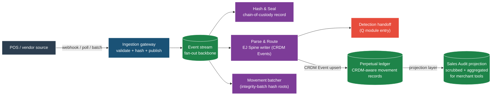

# Stock Ledger — The Perpetual-Inventory Movement Ledger

**Governing thesis.** The stock ledger is the integrity surface on which every module in the Canary Retail spine communicates. It is not an identity master; it is a signed-movement ledger keyed to `item × location × time`, with quantity and value posted together. Three invariants govern: conservation of stock, cost-method consistency, and cycle-count reconciliation. Every spine module either publishes movement events to the ledger, subscribes to ledger state, or reconciles against it. Without the ledger, downstream consensus on on-hand quantity, cost, margin, and shrink falls apart. With it, the ledger becomes the substrate that makes the entire 13-module retail operating system coherent.

> **CRDM source-of-truth note.** Stock ledger entries are the perpetual-movement projection of CRDM Events with conservation invariants. Every movement resolves People (employee, customer, supplier), Places (location), Things (item, device) against [[crdm|CRDM]] as source of truth. The ledger does not duplicate identity; it references it.

## Canary's perpetual-write pipeline (TSP)

Canary instantiates the perpetual-write side of this substrate as the **Transaction Sealing Pipeline (TSP)** — a four-subscriber Valkey-streamed architecture that ingests POS events, hashes them for chain-of-custody, parses them into the EJ Spine (CRDM Events with full child detail), and hands off to detection. Substrate view (full Canary-internal detail in atlas figure P-00):

**Read against the substrate:**

- The "Parse & Route" stage is where the Canary instantiation writes the **EJ Spine** — the row-level perpetual record carrying every transaction + child tables (line items, tenders, discounts, modifiers, etc.). This is the perpetual movement layer materializing.
- The "Hash & Seal" stage is the chain-of-custody seal — independent of the EJ write, providing forensic integrity to raw bytes before any business logic runs.
- The "Movement batcher" produces integrity-batch hash roots (Merkle-style aggregation) over committed movements. Downstream attestation paths exist (ordinals anchor, etc.) but those are pre-audit research and are NOT part of this substrate's trust narrative — see [[../../GrowDirect/Brain/wiki/canary-raas-positioning|RaaS positioning guardrail]].
- The "Sales Audit projection" downstream of the perpetual ledger is the scrub-and-aggregate layer ([[../../GrowDirect/Brain/wiki/canary-ej-spine-and-sales-audit|EJ Spine + Sales Audit anchor]]) that downstream consumers (merchant accounting tools, period reports) actually subscribe to. The merchant's existing system never reads raw EJ — it reads Sales Audit-scrubbed projections.

This shape is the **perpetual-write side of the [[perpetual-vs-period-boundary|perpetual-vs-period boundary]]**. Phase 1 install lands a merchant here with zero migration friction.

---

## The Ledger as Integrity Surface

The perpetual-inventory stock ledger is a time-indexed, double-entry record of every movement of stock through a retail organization. Every posted movement answers four questions:

1. **What moved?** Item × location (SKU, store or warehouse)
2. **How much?** Quantity in base unit of measure (units, cases, pounds)
3. **What is it worth?** Cost and retail value at time of posting
4. **Why?** Reason code (receipt, sale, transfer, adjustment, shrink, etc.)

The ledger is perpetual — always current — because it posts every movement in real time. Contrast with periodic systems that take a physical count once per quarter or year and derive on-hand backward. Perpetual systems are the only way SMB retailers can run replenishment, allocation, cycle counts, and financial close correctly.

The ledger is the only single source of truth for stock-on-hand across the entire retail operation. If the sales module says 42 units sold but the ledger shows 50 units out of stock, the reconciliation happens *on the ledger*, not in a side calculation. If the warehouse says it transferred 100 units but the store says it received 95, the difference is a posted discrepancy on the ledger with a reason code (damage, transit loss, count variance). The ledger is not a reporting view; it is the authoritative book of record.

---

## The Three Invariants

Three invariants are load-bearing across every posted movement. Violating any one causes downstream systems to malfunction.

### 1. Conservation of Stock

Every movement is a signed pair: an increment on one side of the equation and a decrement on the other, or a standalone decrement with a mandatory reason code. Stock cannot appear or disappear without a posted explanation. The invariant holds at every aggregation level: per item, per location, per department, per store hierarchy.

Examples:
- Receipt: supplier → location adds stock; supplier account decreases.
- Sale: location decreases stock; customer account reflects unit sold.
- Transfer: location A decreases, location B increases by the same quantity.
- Adjustment: in-place change with mandatory reason code (e.g., "count variance," "damaged goods," "price adjustment").

The reason-code requirement is the mechanism that enforces conservation. No ad-hoc changes without a recorded reason — every adjustment to total stock on hand carries the reason for why the adjustment was needed. This is the governance layer of the ledger.

### 2. Cost-Method Consistency

The ledger carries both quantity AND value. Every posted movement reflects the organization's chosen method for valuing inventory: Retail Inventory Method (RIM), Cost Method, or hybrid approaches for mixed departments.

- Under **RIM**, on-hand is valued at retail; cost is derived at period close via cost complement (cost ÷ retail at department/class level). VAT is reflected in the retail value where applicable.
- Under **Cost Method**, on-hand is valued at landed unit cost (FIFO, weighted-average, or standard cost). VAT is reflected as part of the landed cost.
- Consignment and concession items are special cases: they post to the ledger with cost treatment distinct from owned inventory.

The consistency rule means: every single movement must post the cost method of its department or item. Mixed methods within a location are permissible (soft-line in RIM, hard-line in Cost). Mixed methods *within a single item* are not; if an item moves from RIM to Cost department, the reclassification must post cost revaluation explicitly.

### 3. Cycle-Count Reconciliation

Physical reality reconciles to the ledger, not the reverse. This is the discipline that makes perpetual systems work.

When a cycle count takes place, the process is:

1. **Snapshot**: Immediately prior to the count date, the ledger state is captured — the "expected on-hand" that reconciliation targets.
2. **Physical count**: Actual units are counted at location.
3. **Variance**: Difference between physical count and ledger snapshot is calculated.
4. **Posting**: Variance is posted back to the ledger as a count-adjustment movement with the reason code "cycle count variance."

The ledger is never adjusted retroactively; the historical record stands. The count adjustment is a new posted movement that brings the ledger into agreement with physical reality. If the count finds 98 units but the ledger said 100, a -2 adjustment is posted with reason "cycle count variance — shrink."

This discipline means cycle counts are reconciliation events, not inventory-reset events. It also means shrink can be attributed to specific time periods and locations because the variance is posted as a dated movement.

---

## The Canonical Movement Verbs

The ledger's native vocabulary is a set of movement types. Every movement in the retail operation is one of these types, posted with the item, location, quantity, value, and reason code:

| Movement | Origin → Destination | Qty effect | Value effect | Reason codes |
|---|---|---|---|---|
| **Receipt (PO/BOL)** | Supplier → store/WH | +qty | +cost (landed) | PO number, receipt date, supplier variance |
| **ASN / Receiving** | Supplier → in-transit | +qty pending | cost held pending | ASN number, expected receipt date |
| **Transfer (intra-company)** | Loc A → Loc B | -qty A, +qty B | upcharges if applicable | Transfer request, authorization, transit reason |
| **Allocation** | WH → stores (1:N) | reserves qty | holds value per store | Allocation order, demand plan |
| **Sale (POS)** | Location → customer | -qty | -cost, +retail | SKU, cashier, tender, auth code |
| **Return (customer)** | Customer → location | +qty | reverse sale | Reason (salable, defect, wrong item, etc.) |
| **RTV (Return to Vendor)** | Location → supplier | -qty | cost reversal | RTV authorization, reason (defect, overstock, etc.) |
| **Inventory adjustment** | In-place | +/-qty | +/-cost | Reason (shrink, damage, gift, found, etc.) |
| **Cycle count** | Physical reconciliation | delta | delta | Count variance, location, count date |
| **Shrink (derived)** | In-place | -qty | -cost | Shrink reason (theft, waste, recordation, etc.) |
| **Reclassification** | Hierarchy change | no physical move | value move only | New department/class, reclass date |
| **Stock ledger close** | Period end | aggregation | GL posting | Period end date, close code |
| **VAT posting** | Per movement | no qty | tax accrual | Tax rate, jurisdiction, effective date |

Each movement type is named, has an authoritative origin, and produces a ledger entry that is immutable once posted. The verb taxonomy is exhaustive — every real-world retail event maps to one of these. If an event doesn't fit, it is either a novel movement type that needs to be defined, or it is a compound event (a single business transaction that produces multiple ledger movements).

---

## Publisher / Subscriber / Reconciler Pattern

The architecture of how modules interact with the ledger is three-fold:

### Publishers

Modules that post movements to the ledger:

- **T (Transaction Pipeline)** — publishes every POS sale as a movement (item, location, qty, cost, retail, time)
- **D (Distribution)** — publishes receipts (PO line → store/WH), transfers (store A → store B), RTVs (store → supplier), and adjustments (damage, shrink)
- **C (Commercial)** — publishes cost-update events when landed cost or retail changes (e.g., supplier invoice variance, markdown markdown/promotion event)
- **P (Pricing & Promotion)** — publishes price-change events that affect the value side of the ledger

### Subscribers

Modules that read the ledger to drive their own logic:

- **J (Forecast & Order)** — reads movement history to derive demand and forecast; reads SOH to validate replenishment parameters
- **S (Space, Range, Display)** — reads SOH and movement history to validate planogram capacity constraints; enforces ordering gate (item cannot be ordered until ledger is ready)
- **F (Finance)** — reads the ledger at period close to drive GL posting, OTB reconciliation, and margin calculation

### Reconcilers

Modules that validate ledger state against external sources:

- **F (Finance)** — Invoice Matching function: reconciles supplier invoice against receipts; posts cost variance if amounts don't match within tolerance
- **W (Work Execution)** — Exception detection: reads ledger movements and flags anomalies (impossible quantities, inconsistent timing, reason codes outside policy)

This three-layer pattern is how the ledger becomes the substrate rather than just another system. Every module knows how to speak to it; no module has direct dependencies on other modules. The ledger is the message bus.

---

## The 13-Module Spine, Mapped to Ledger Roles

Each of the 13 modules in Canary Retail's capability spine has a defined role on the ledger:

| Prefix | Module | Ledger role | Movements published | Ledger reads |
|---|---|---|---|---|
| **T** | Transaction Pipeline | Publisher | Sale, return (from POS) | None (writes only) |
| **R** | Customer | Dimension | None (people, not stock) | None (references T movements) |
| **N** | Device | Dimension | None (things, not stock) | None (references T movements) |
| **A** | Asset Management | Analyst | None (detects on T events) | Reads T through W |
| **Q** | Loss Prevention | Reconciler | Adjustment (shrink cases) | Reads all movements for case evidence |
| **C** | Commercial | Publisher & Analyst | Cost-update events | Reads item master lookups |
| **D** | Distribution | Publisher | Receipt, transfer, RTV, adjustment | Reads SOH, movement history |
| **F** | Finance | Reconciler | GL posting, period-close aggregation | Reads entire ledger for reporting |
| **J** | Forecast & Order | Subscriber | None (generates POs, not ledger moves) | Reads movement history, SOH, replenishment params |
| **S** | Space, Range, Display | Subscriber & Gatekeeper | None (drives ordering gate) | Reads SOH for capacity validation |
| **P** | Pricing & Promotion | Publisher | Price-change events | Reads retail values |
| **L** | Labor & Workforce | Dimension | None (people scheduling) | None (references T movements) |
| **W** | Work Execution | Reconciler | Adjustment (exceptions) | Reads all modules' movements |

---

## Why This Matters for SMB Retail

The stock ledger is the integrity guarantee that is missing from POS-only retail today. Most SMB retailers run their business on a POS system that captures sales and produces daily/weekly reports. They export those reports to spreadsheets for inventory management. They reconcile by hand once a month or quarter. They write off shrink as a percentage of sales rather than attributing it to specific items, locations, or time periods.

With a perpetual stock ledger:

- **Correct margin calculation.** Cost flows correctly; markdown is tracked; shrink is attributable. Margin is known per item, per location, per period — not estimated.
- **Accurate shrink attribution.** Instead of a blanket shrink percentage, shrink is attributed to specific SKUs, locations, and time periods. This enables root-cause investigation (theft, damage, recordation error, waste) and corrective action.
- **Real-time replenishment.** The ordering system (J module) reads true on-hand from the ledger. Replenishment recommendations are based on actual stock position, not estimated position.
- **OTB enforcement that works.** The buyer commits POs against Open-to-Buy. The ledger posts actual receipts, sales, and markdowns. At any moment, the system knows whether the buyer is within OTB headroom.
- **Cycle-count discipline.** Physical counts reconcile to the ledger. Variances are posted with reason codes. Management can see shrink trends and respond.

The ledger is not a nice-to-have for large retailers. It is the foundation on which every other module sits. Without it, the financial and operational systems of the store become disconnected from reality.

---

## Implementation Note — Canary's Starting Point

Canary's v1 Transaction Pipeline (T module) already publishes the sale movement to a ledger-like structure: the `app.evidence_records` and `sales.transactions` tables carry item, location, qty, cost, retail, and timestamp. The Q module (Loss Prevention) reads these records to drive detection rules.

Extending this to a full perpetual stock ledger means:

1. Formalizing the movement schema to carry reason codes, cost method, and status flags.
2. Adding publisher endpoints for D (Distribution), C (Commercial), and P (Pricing) modules.
3. Adding subscriber patterns for J (Forecast), S (Space), and F (Finance).
4. Implementing the reconciliation gates for F (Invoice Matching) and W (Exception Detection).
5. Building the cycle-count reconciliation flow with variance posting.
6. Implementing cost-method routing so RIM and Cost Method departments post correctly.

The infrastructure is already in place. The buildout is systematic.

---

## Open Questions

- **Period close cadence.** Daily? Weekly? Monthly? For SMB retail, weekly is likely the minimum; daily is feasible. What is the right trade-off between timeliness and batch-job cost?
- **Shrink-reason taxonomy.** "Shrink" is a catch-all. Is it theft, damage, waste, reconciliation error, or something else? The reason codes need to be specific enough that management can act on them.
- **Ledger compaction policy.** The perpetual ledger can grow to millions of rows per year for a busy location. How long are full-detail ledger records retained? When do they compact to summarized monthly records?
- **Cost variance handling.** When an invoice doesn't match a receipt, the cost variance is a separate adjustment movement. How is this movement routed? By supplier? By category? By magnitude of variance?

---

## Related

- [[retail-accounting-method|Retail Accounting Method — RIM, Cost Method, Open To Buy]]
- [[satoshi-cost-accounting|Satoshi-Level Cost Accounting — Sub-Cent Unit Cost on the Stock Ledger]]
- [[../../GrowDirect/Brain/wiki/third-branch|The Third Branch]] (three-canonical framing)
- [[../../GrowDirect/Brain/wiki/intactix-canonical-validation|Intactix Canonical Validation]] (ordering gate against the ledger)
- [[../../GrowDirect/Brain/wiki/tesco-technical-library|Tesco Technical Library]] (pack-copy compile gate)
- [[spine-13-prefix|The Canary Retail Spine — 13 Modules]]
- [[crdm|Canonical Retail Data Model (CRDM)]]

---

*Classification: confidential. Owner: GrowDirect LLC. Created 2026-04-24. The perpetual stock ledger is a platform substrate document. Merchant-facing documentation should reference this as the technical backbone without requiring customers to read it directly.*
